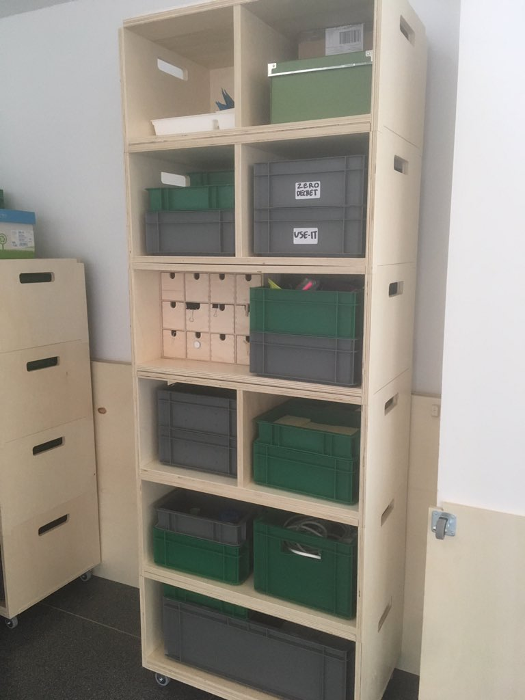
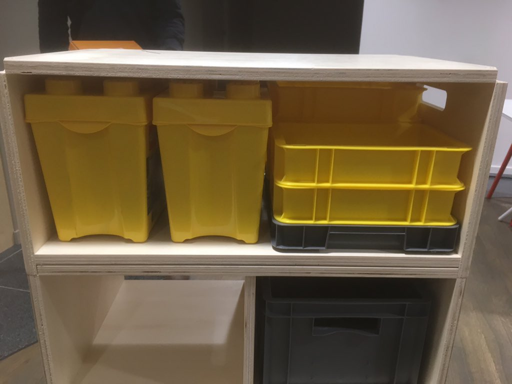
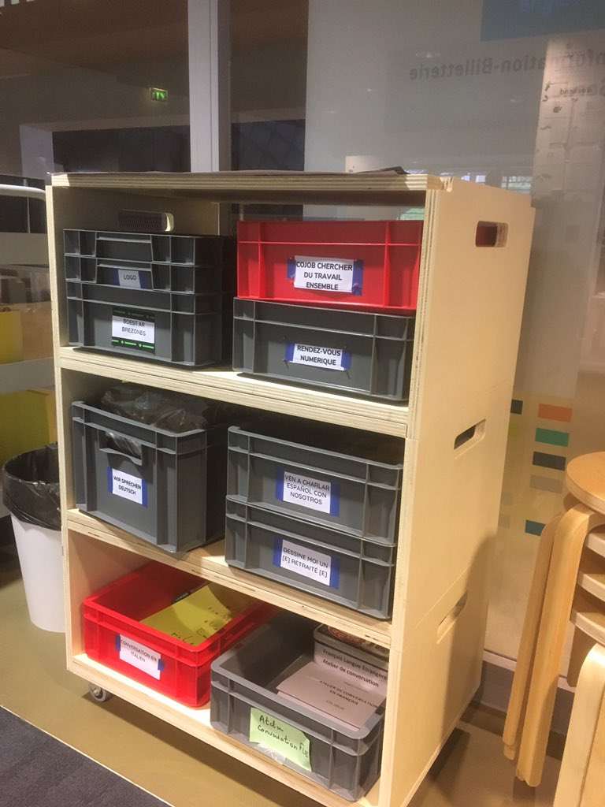

# Le mobilier modulaire des Rendez-vous 4C 

Les "meubles-lego" des #rdv4c sont des meubles modulables pour s'adapter aux besoins divers des publics.

Des meubles personnalisés, imaginés par l'équipe des Rendez-vous 4C aux Champs Libres et dessinés avec l'aide du service technique.

Les fichiers sources des meubles fait sur mesure pour les Rendez-vous 4C sont au format .layout issu de SketchUp.
 
Ils sont disponibles sous licence libre avec mention : Sylvio Crescoli - Les Champs Libres.

Inclus également un fichier PDF et 4 images de présentation des meubles

